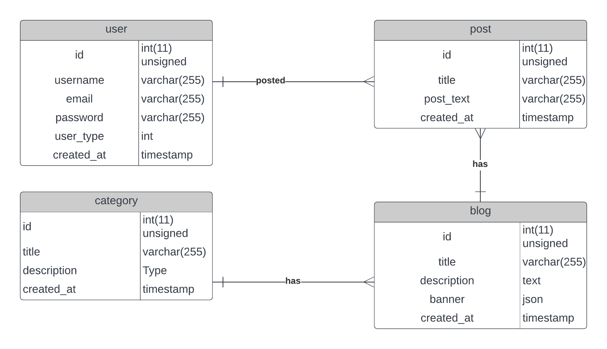

# Launch Instructions (Without Docker)

1. Install Python 3.10
2. Open terminal and enter `pip install -r requirements.txt` to install necessary libraries. You should do this on a virtual environment although that is not mandatory.
3. Enter proper MySQL and Redis database configuration in `settings.py`.
4. Run migrations with `python manage.py makemigrations` and `python manage.py migrate`.
5. Run development server with `python manage.py runserver`

# Launch Instructions (With Docker)

1. Install Docker by following official instructions from https://docs.docker.com/
2. Open terminal on the project folder and run `docker compose up db`, `docker compose up redis`, `docker compose up api`.
3. The api endpoints will be served on localhost:8000

# **TESTING**

Run `python manage.py test` to run the tests from tests.py in each module.

# Entity Relationship Diagram

# API Doc

| Endpoint                     | Action             | Description                              | Permission                                             |
| ---------------------------- | ------------------ | ---------------------------------------- | ------------------------------------------------------ |
| admin/                       |                    | Custom admin panel with Django templates | Superuser                                              |
| accounts/auth/token/         | POST               | send email and password to get token     | Authenticated                                          |
| accounts/auth/token/refresh/ | POST               | send email and password to get token     | Authenticated                                          |
| accounts/users/              | GET,POST           | GET: list all users POST: create user    | Anyone                                                 |
| accounts/users/\<int:pk>/    | GET,POST,PUT,PATCH | RUD on a single user                     | Superuser or Self                                      |
| blogs/                       | GET,POST           | GET: list all POST: create               | Anyone can get, only Author and Superuser can POST     |
| blogs/\<int:pk>/             | GET,POST,PUT,PATCH | RUD on a single Blog                     | Superuser or Authors if they are the owner of the blog |
| blogs/\<int:pk>/posts        | GET                | Get posts from one blog                  | Anyone                                                 |
| posts/                       | GET,POST           | GET: list all POST: create               | Anyone can get, only Author and Superuser can POST     |
| posts/\<int:pk>/             | GET,POST,PUT,PATCH | RUD on a single Post                     | Superuser or Authors if they are the owner of the blog |
| categories/                  | GET,POST           | GET: list all POST: create               | Anyone can get, Superuser can POST                     |
| categories/\<int:pk>/        | GET,POST,PUT,PATCH | RUD on a single Category                 | Only Superuser can POST, PUT, PATCH. Anyone can GET.   |
